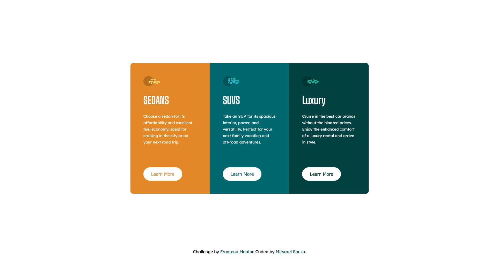

# Frontend Mentor - 3-column preview card component solution

This is a solution to the [3-column preview card component challenge on Frontend Mentor](https://www.frontendmentor.io/challenges/3column-preview-card-component-pH92eAR2-). Frontend Mentor challenges help you improve your coding skills by building realistic projects. 

## Table of contents

-   [Overview](#overview)
    -   [The challenge](#the-challenge)
    -   [Screenshot](#screenshot)
    -   [Links](#links)
-   [My process](#my-process)
    -   [Built with](#built-with)
    -   [What I learned](#what-i-learned)
    -   [Continued development](#continued-development)
    -   [Useful resources](#useful-resources)
-   [Author](#author)

## Overview
  This project is an example of a Product preview card component

### The challenge

Users should be able to:

-   View the optimal layout depending on their device's screen size
-   See hover and focus states for interactive elements

### Screenshot
<div align="center">
    
  
  <br /><br /><br />

  
  <br /><br /><br />
  
</div>

### Links

-   Solution URL: [GitHub source code](https://github.com/M-its/3-column-preview-card-component)
-   Live Site URL: [Product preview card component page](https://m-its.github.io/3-column-preview-card-component/)

## My process

### Built with

-   Semantic HTML5 markup
-   CSS custom properties
-   Flexbox
-   Mobile-first workflow

### What I learned

In this project i was able to use media queries and a mobile-first workflow, besides praticing nth-child pseudo-element.

examples on the code snippet bellow:

```css
.card:nth-child(1) {
    background-color: var(--bright-orange);
    border-radius: 10px 10px 0 0;
}

.card:nth-child(2) {
    background-color: var(--dark-cyan);
}

.card:nth-child(3) {
    background-color: var(--very-dark-cyan);
    border-radius: 0 0 10px 10px;
}
```

### Continued development

Learn more about :nth-child.

### Useful resources

-   [W3Schools - CSS :nth-child() Selector](https://www.w3schools.com/CSSref/sel_nth-child.php) - This article helped me understend nth-child usage.

-   [W3Schools - Accessibility Landmarks](https://www.w3schools.com/accessibility/accessibility_landmarks.php) - This article have good tips of landmarks and their usage.

## Author

-   GitHub - [@M-its](https://github.com/M-its)
-   Frontend Mentor - [@M-its](https://www.frontendmentor.io/profile/M-its)
-   Codepen - [@M-its](https://codepen.io/m-its)
